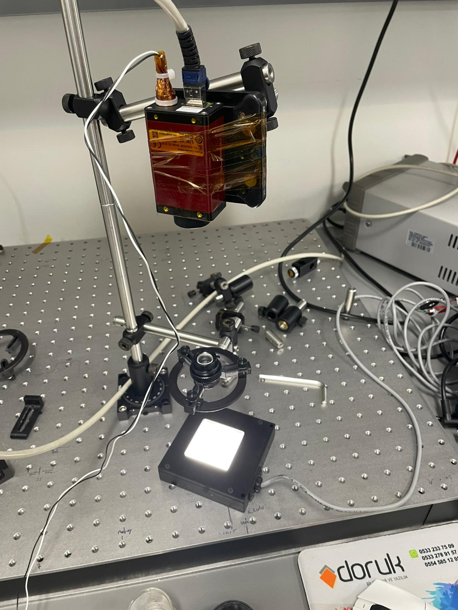

# Lens Distortion Measurement and Correction

This repository contains a grid-based lens distortion measurement and image correction workflow developed for Mitutoyo CF 2X, 3X, and 5X lenses. The project uses ThorLabs 0.125 mm pitch dot-grid target images to estimate geometric residual distortion, fit a mathematical correction model for each lens, and apply the model to new images using inverse remapping.

The full TIFF datasets are not included in this repository in order to keep the repository lightweight. A small sample subset is provided for demonstration purposes.

## Project Goals

- Detect dot-grid centers from microscope/lens images.
- Estimate the ideal grid position using planar homography.
- Compute residual displacement vectors between measured and ideal grid points.
- Fit a separate 5th-degree two-dimensional polynomial displacement model for each lens.
- Correct distorted images using `cv2.remap` and inverse mapping.
- Compare residual error before and after correction.
- Provide reproducible scripts and compact result files for review and further development.

## Lab Test Environment

The experimental setup was tested in a laboratory environment using microscope optics and a dot-grid calibration target.



## Mathematical Model

Pixel coordinates are first normalized with respect to the image center:

```text
X = (x - cx) / s
Y = (y - cy) / s
```

For each lens, the displacement field is modeled separately in the x and y directions:

```text
d_x(x,y) = sum_{i+j<=5} a_ij * X^i * Y^j
d_y(x,y) = sum_{i+j<=5} b_ij * X^i * Y^j
```

The corrected image is generated by inverse remapping:

```text
I_corrected(x,y) = I_distorted(x + d_x(x,y), y + d_y(x,y))
```

In other words, for each pixel `(x,y)` in the corrected image, the model computes the corresponding sampling location in the original distorted image.

## Repository Structure

```text
lens-distortion-correction/
  README.md
  requirements.txt
  .gitignore
  data/
    README.md
    sample/
      2x/
      3x/
      5x/
  docs/
    Distorsiyon_Modelleme_Raporu.md
    Distorsiyon_Modelleme_Raporu.pdf
    lab_test_environment.jpeg
  results/
    2x/
      summary.json
      distortion_model.json
    3x/
      summary.json
      distortion_model.json
    5x/
      summary.json
      distortion_model.json
    lens_distortion_type_analysis.json
    runtime_benchmark/
      3x_runtime_benchmark.json
  scripts/
    analyze_grid_distortion.py
    apply_distortion_model.py
    benchmark_distortion_runtime.py
```

## Installation

```powershell
python -m venv .venv
.\.venv\Scripts\Activate.ps1
pip install -r requirements.txt
```

## Usage

### 1. Grid Distortion Measurement

Place the input TIFF images under `data/`. Example command:

```powershell
python scripts\analyze_grid_distortion.py `
  --input data\3x `
  --glob "3x Lens v2_*.tiff" `
  --output output\3x_v2_distortion `
  --grid-pitch-mm 0.125 `
  --rows 59 `
  --cols 59
```

This step produces files such as:

```text
summary.json
distortion_points.csv
radial_summary.csv
visual validation images
```

### 2. Polynomial Model Fitting and Image Correction

```powershell
python scripts\apply_distortion_model.py `
  --points output\3x_v2_distortion\distortion_points.csv `
  --summary output\3x_v2_distortion\summary.json `
  --input data\3x `
  --glob "3x Lens v2_*.tiff" `
  --output output\3x_v2_correction_model `
  --degree 5
```

This step writes:

```text
distortion_model.json
distortion_model_equation.txt
corrected_images/
comparisons/
```

### 3. Runtime Benchmark

```powershell
python scripts\benchmark_distortion_runtime.py `
  --model results\3x\distortion_model.json `
  --image "data\sample\3x\3x Lens v2_1.tiff" `
  --output output\benchmark\3x_corrected.tiff `
  --json-output output\benchmark\3x_runtime.json `
  --iterations 25 `
  --threads 1
```

On the reference PC, the remapping-only correction time for one 2048 x 2048 16-bit image was measured at approximately 85 ms. The target PolarFire hardware was not available during this work; therefore, final hardware timing must be verified on the target using `readmcycle()`.

## Summary Results

| Lens | Dataset | Grid points | P95 before | P95 after | Distortion type interpretation |
|---|---|---:|---:|---:|---|
| 2X | v2 | 2116 | 0.7812 px | 0.6626 px | Mixed / asymmetric |
| 3X | v2 | 3481 | 0.4708 px | 0.1535 px | Mixed / mustache-like |
| 5X | v2 | 1681 | 0.6603 px | 0.2541 px | Mixed / mustache-like |

## Sample Dataset Policy

The full raw TIFF datasets are not tracked in this repository. To avoid filling GitHub storage with large image data, only a small sample subset is included:

| Lens | Source dataset | Sample images included |
|---|---|---:|
| 2X | v2 | 5 |
| 3X | v2 | 5 |
| 5X | v2 | 5 |

The full measurements reported in `results/` were generated using the complete 100-image v2 datasets for each lens. The `data/sample/` folder is intended only for demonstration and small-scale testing.

## Notes and Limitations

- The polynomial coefficients are valid for the same lens, sensor geometry, working distance, focus condition, and image resolution.
- If the optical setup changes, the distortion model should be recalibrated.
- The residual field may include lens distortion, target alignment error, target flatness error, illumination effects, and point-detection noise.
- The included PDF report in `docs/` provides the detailed mathematical explanation and experimental interpretation.

## Main Scripts

- `analyze_grid_distortion.py`: detects grid points, estimates homography residuals, and exports distortion metrics.
- `apply_distortion_model.py`: fits the polynomial displacement model and applies image correction using inverse remapping.
- `benchmark_distortion_runtime.py`: measures remapping runtime for a selected image and model.
